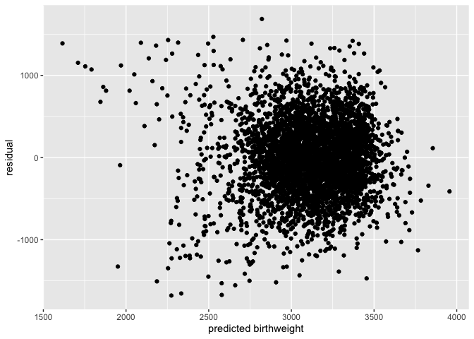
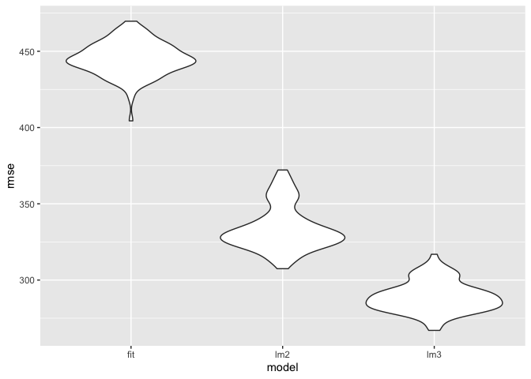
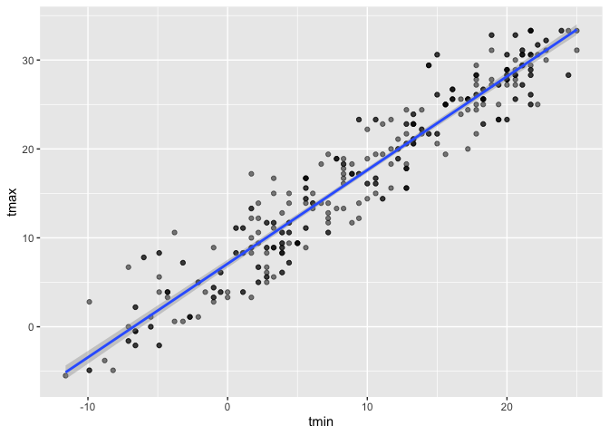
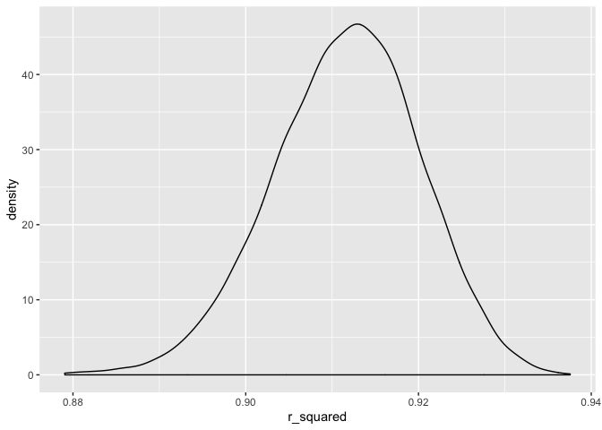
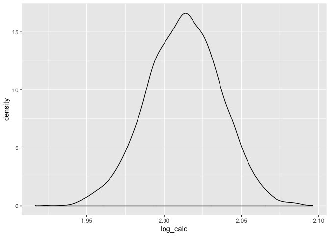

Homework 6
================
Dania Jafar
11/15/2019

``` r
birthweight = read.csv("./birthweight.csv") %>% 
  mutate(babysex = as.factor(babysex),
         frace = as.factor(frace),
         mrace = as.factor(mrace),
         malform = as.factor(malform))
```

# Problem 1

``` r
#In this model, I have decided to use mother's smoking status, race, age at delivery, and baby's gestational age in weeks as the predictors for my model. I have chosen these factors as they seem to be some of the most important predictors for a child's weight at birth. 

birthweight2 = birthweight %>% #create a new dataset for the model I want to generate
  select(bwt, smoken, mrace, gaweeks, momage)

fit = lm(bwt ~ smoken + mrace + gaweeks + momage, data = birthweight2)

#obtaining a quick summary of the model 
fit %>% 
  broom::glance()
```

    ## # A tibble: 1 x 11
    ##   r.squared adj.r.squared sigma statistic   p.value    df  logLik    AIC
    ##       <dbl>         <dbl> <dbl>     <dbl>     <dbl> <int>   <dbl>  <dbl>
    ## 1     0.245         0.244  445.      234. 7.92e-260     7 -32639. 65294.
    ## # … with 3 more variables: BIC <dbl>, deviance <dbl>, df.residual <int>

``` r
fit %>% 
  broom::tidy() %>% 
  select(term, estimate, p.value) %>% 
  knitr::kable(digits = 3)
```

| term        |  estimate | p.value |
| :---------- | --------: | ------: |
| (Intercept) |   903.922 |   0.000 |
| smoken      |  \-10.885 |   0.000 |
| mrace2      | \-280.481 |   0.000 |
| mrace3      | \-185.959 |   0.007 |
| mrace4      | \-188.887 |   0.000 |
| gaweeks     |    59.560 |   0.000 |
| momage      |     2.124 |   0.258 |

``` r
library(modelr)

#create a variable that predicts birthweight

birthweight2 = modelr::add_predictions(birthweight2, fit)

#plots of birthweight by residuals 
plot1 = 
birthweight2 %>%   #scatter plot
  modelr::add_residuals(fit) %>% 
  ggplot(aes(x = pred, y = resid)) + geom_point() +
  labs(x = "predicted birthweight", y = "residual")

plot1
```

<!-- -->

``` r
#Modeling the two other models that are given

linear_mod2 = lm(bwt ~ blength + gaweeks, data = birthweight)
linear_mod3 = lm(bwt ~ bhead + blength + babysex + bhead*blength + bhead*babysex + blength*babysex + bhead*blength*babysex, data = birthweight)

 #plotting a model to get a sense for their goodness of fit.

cv_df = 
  crossv_mc(birthweight, 100)

cv_df =
  cv_df %>% 
  mutate(
    train = map(train, as_tibble),
    test = map(test, as_tibble))

cv_df = 
  cv_df %>% 
  mutate(fit  = map(train, ~lm(bwt ~ smoken + mrace + gaweeks + momage, data = .x)),
         linear_mod2  = map(train, ~lm(bwt ~ blength + gaweeks, data = .x)),
         linear_mod3  = map(train, ~lm(bwt ~ bhead + blength + babysex + bhead*blength + bhead*babysex + blength*babysex + bhead*blength*babysex, data = .x))) %>% 
  mutate(rmse_fit = map2_dbl(fit, test, ~rmse(model = .x, data = .y)),
         rmse_lm2 = map2_dbl(linear_mod2, test, ~rmse(model = .x, data = .y)),
         rmse_lm3 = map2_dbl(linear_mod3, test, ~rmse(model = .x, data = .y)))

cv_df %>% 
  select(starts_with("rmse")) %>% 
  pivot_longer(
    everything(),
    names_to = "model", 
    values_to = "rmse",
    names_prefix = "rmse_") %>% 
  mutate(model = fct_inorder(model)) %>% 
  ggplot(aes(x = model, y = rmse)) + geom_violin()
```

<!-- -->

``` r
#I can see that linear model three (lm3) is the best one because it produces the lowest root mean square error. 
```

# Problem 2

``` r
weather_df = 
  rnoaa::meteo_pull_monitors(
    c("USW00094728"),
    var = c("PRCP", "TMIN", "TMAX"), 
    date_min = "2017-01-01",
    date_max = "2017-12-31") %>%
  mutate(
    name = recode(id, USW00094728 = "CentralPark_NY"),
    tmin = tmin / 10,
    tmax = tmax / 10) %>%
  select(name, id, everything())
```

    ## Registered S3 method overwritten by 'crul':
    ##   method                 from
    ##   as.character.form_file httr

    ## Registered S3 method overwritten by 'hoardr':
    ##   method           from
    ##   print.cache_info httr

    ## file path:          /Users/dania/Library/Caches/rnoaa/ghcnd/USW00094728.dly

    ## file last updated:  2019-10-01 08:28:51

    ## file min/max dates: 1869-01-01 / 2019-09-30

``` r
#Create a linear model
lm(tmax ~ tmin, data = weather_df) %>% 
  broom::tidy() %>% 
  knitr::kable(digits = 3)
```

| term        | estimate | std.error | statistic | p.value |
| :---------- | -------: | --------: | --------: | ------: |
| (Intercept) |    7.209 |     0.226 |    31.847 |       0 |
| tmin        |    1.039 |     0.017 |    61.161 |       0 |

``` r
#Create the boot sample
x = weather_df

boot_sample = function(x) {
  sample_frac(x, replace = TRUE)
}

#Check to see if this is working.

boot_sample(x) %>% 
  ggplot(aes(x = tmin, y = tmax)) + 
  geom_point(alpha = .5) +
  stat_smooth(method = "lm")
```

<!-- -->

``` r
#Drawing 5000 bootstrap samples

boot_straps_data = 
  list(
    strap_number = 1:5000,
    strap_sample = rerun(5000, boot_sample(x))
  )

#Getting the r-hat-squared
weather_bootstrap = weather_df %>% 
  modelr::bootstrap(n = 5000) 

weather1 = weather_bootstrap %>% 
  mutate(
    models = map(strap, ~lm(tmax ~ tmin, data =.x)),
    results = map(models, broom::glance)) %>% 
    select(-strap, -models) %>% 
    unnest(results) %>% 
    janitor::clean_names() 

weather1 %>% 
  ggplot(aes(x = r_squared)) + #create a density plot of r-squared
  geom_density()
```

<!-- -->

``` r
#getting quantiles/ 95% CI
weather1 %>% 
  pull(r_squared) %>% 
quantile(., probs = c(0.025, 0.975, 0.95), na.rm = TRUE)
```

    ##      2.5%     97.5%       95% 
    ## 0.8944239 0.9267152 0.9246803

``` r
#Getting the log(β̂ 0∗β̂ 1)
data1 = 
weather_bootstrap%>% 
  mutate(
    models = map(strap, ~lm(tmax ~ tmin, data =.x)),
    results = map(models, broom::tidy)) %>% 
    select(-strap, -models) %>% 
    unnest(results) %>% 
   janitor::clean_names() %>% 
   select(id, term, estimate) %>% 
   # spread(key = term, value = estimate)
  pivot_wider(
    names_from = "term",
    values_from = "estimate"
  )  %>%
  rename(intercept= '(Intercept)') %>% 
  mutate(log_calc = log(intercept*tmin)) 

data1 %>% 
   pull(log_calc) %>% 
  quantile(., probs = c(0.025, 0.975, 0.95), na.rm = TRUE)
```

    ##     2.5%    97.5%      95% 
    ## 1.965795 2.059422 2.051686

``` r
data1 %>% 
  ggplot(aes(x = log_calc)) + #create a density plot of r-squared
  geom_density()
```

<!-- -->
